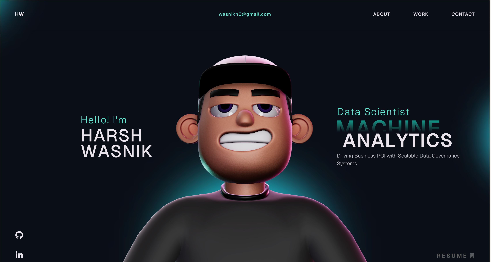

# Harsh Wasnik Portfolio

This repository contains my personal portfolio website built with React, TypeScript, GSAP, and Three.js.

## Home Page Preview



## Tech Stack

- React + TypeScript + Vite
- GSAP (ScrollTrigger, ScrollSmoother, SplitText)
- Three.js + React Three Fiber + Rapier
- CSS

## Features

- Animated landing and custom loader
- Interactive 3D character and physics-based tech section
- Project carousel with custom cards
- Data Science and AI/ML focused content sections
- Contact and social links integration

## Getting Started

1. Install dependencies:

```bash
npm install
```

2. Run development server:

```bash
npm run dev
```

3. Build for production:

```bash
npm run build
```

4. Preview production build locally:

```bash
npm run preview
```

## Resume Download Setup

The resume button points to:

`/public/resume/Harsh_Wasnik.pdf`

Place your PDF at that path so users can download it directly from the site.

## Repository Structure

- `src/components` - UI sections and interactive components
- `src/components/styles` - section-level CSS files
- `public/images` - static images and assets
- `public/models` - 3D and HDR assets

## License

This project is open source and available under the [MIT License](LICENSE).
